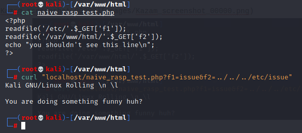

# Naive RASP

This is a naive implementation of PHP RASP in a form of PHP extension, which aims to detect and stop the path traversal attack leading to local file disclosure.

### Requirement

This PHP extension was developed under PHP-7+

### Install

##### Compile naive_taint in Linux

```
$ /path/of/phpize

$ ./configure --with-php-config=/path/of/php-config

$ make && make install
```

edit the php.ini to enable the extension

### Usage

You don't have to do anything, the extension will watch out for dangerous arguments passed to functions like `fopen`, `readfile`, and `file_get_contents`, and it will stop the execution when needed. Just like below


